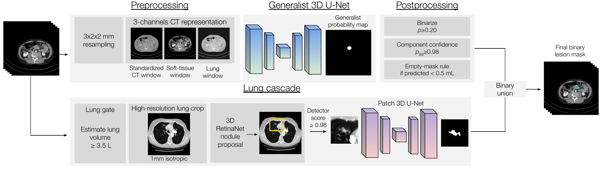

# OmniLesion

Pan-cancer lesion segmentation in CT under heterogeneous and partial annotation.
Nucleo Research's submission to the MICCAI FLARE 2026 pan-cancer segmentation task (Task 1), released so that the
whole system can be retrained, run and evaluated from this repository alone.

One residual-encoder 3D U-Net at 3 x 2 x 2 mm segments lesions of any type anywhere in the scan. It is trained with a
component-balanced Dice term (every annotated lesion counts equally, whatever its size), organ-family-balanced case
sampling, and a long budget (3.0 M optimiser steps). At inference a confidence rule and an empty rule clean the
probability map, and a lung-nodule cascade (RetinaNet proposals and a 65^3 patch U-Net at 1 mm, run only inside the
lungs of scans that contain them) adds the small pulmonary nodules the coarse grid cannot represent. On the challenge's
hidden validation set (100 cases) the submitted container scores 0.8122 lesion DSC and 0.7642 lesion NSD.



*The system at inference. The CT is resampled to 3 x 2 x 2 mm and expanded into three channels (standardised CT,
soft-tissue window, lung window) for the residual-encoder 3D U-Net; its probability map is binarised at 0.20,
components with 99th-percentile confidence below 0.98 are removed and a negligible total is emptied. In parallel,
a lung gate admits scans with more than 3.5 L of lung; inside their lung box, at 1 mm isotropic spacing, a RetinaNet
proposes nodules and a 65^3 patch U-Net segments each proposal with confidence at least 0.98. The union of both masks
is the output.*

Paper: *Pan-cancer Lesion Segmentation in CT under Heterogeneous and Partial Annotation* (FLARE 2026 proceedings, in
preparation). Section numbers below refer to it.

## Contents

```
omnilesion/                      Python package used by training, inference and the container
  nnunet_trainer/nnUNetTrainerOmniLesion.py   the trainer: 3-channel window input, component-balanced loss,
                                              weighted case sampling, split file, PolyLR exponent, iterations/epoch
  nnunet_trainer/install.py      copies the trainer into the installed nnU-Net package
  postprocess.py                 binarise 0.20, keep components with p99 >= 0.98, empty rule (<= 0.5 mL, <= 2 comps)
  lung_cascade/                  HU lung gate, MONAI RetinaNet detector, 65^3 nodule U-Net, union with the main mask
  inference.py                   whole pipeline on a folder (GPU resampling, TTA rule, time guard, fallbacks)
scripts/
  01_build_nnunet_dataset.py     FLARE release -> nnU-Net raw dataset (symlinks, header repair, dataset.json)
  02_plan_and_preprocess.sh      fingerprint, 3x2x2 mm plan, preprocessing; make_resenc_plans.py derives the plan
  03_build_split.py              train / sentinel case lists
  04_run_totalsegmentator.sh     organ maps for the sampling weights
  05_attribute_lesions.py        lesion component -> organ family
  06_build_case_weights.py       organ-family-balanced sampling weights (alpha = 0.7)
  07_train.sh                    nnUNetv2_train with the submitted settings
  08_predict.py                  segment a folder with the full pipeline
  lung_cascade/                  prepare_nodule_data.py, train_detector.py, train_segmentor.py
  evaluation/                    score_cases.py (DSC/NSD), lesion_level.py, lesion_free_rate.py, efficiency_bench.py
docker/                          Dockerfile, entry point and build-context script of the submitted container
data/                            split, sampling weights, attribution, plan and evaluation lists actually used
tools/                           relabel_release_weights.py, check_release_tree.sh
```

## Environment

Training ran on Ubuntu 24.04, Python 3.12, PyTorch 2.13 with CUDA 13, one NVIDIA H100 80 GB. Inference runs in the
container on PyTorch 2.6 / CUDA 12.4 (Python 3.11). The code depends on nnU-Net v2.6.0 (unmodified), MONAI 1.6.0
(detector), CuPy (GPU connected components in the loss), SimpleITK, nibabel and scipy.

```bash
git clone https://github.com/Nucleo-Research/omnilesion.git && cd omnilesion
python -m venv .venv && source .venv/bin/activate
pip install torch --index-url https://download.pytorch.org/whl/cu124     # or the wheel matching your CUDA
pip install -r requirements-train.txt
python -m omnilesion.nnunet_trainer.install                              # puts the trainer inside nnunetv2
export nnUNet_raw=/data/nnUNet_raw nnUNet_preprocessed=/data/nnUNet_preprocessed nnUNet_results=/data/nnUNet_results
```

`python -m omnilesion.nnunet_trainer.install --check` confirms that nnU-Net resolves `nnUNetTrainerOmniLesion`.

## Data

Register for the FLARE 2026 pan-cancer task and download the labelled training set (`train_label/imagesTr_part1`,
`imagesTr_part2`, `labelsTr_part1`, `labelsTr_part2`; 17,575 CT scans from the cohorts listed in Table 1 of the
paper), the public validation set with labels (50 cases), the hidden validation images (100 cases) and the lesion-free
scans (172 cases). Labels are used exactly as released: no pseudo labels, no masking of partially annotated cases, and
the unlabelled images of the challenge are not used.

## 1. Main model

### 1.1 Dataset, plan, preprocessing

```bash
python scripts/01_build_nnunet_dataset.py --flare-root /data/FLARE2026-Task1 --dataset-id 501
scripts/02_plan_and_preprocess.sh          # DATASET_ID=501 WORKERS=16 by default; ~110 GB of preprocessed .b2nd files
```

The first script builds `Dataset501_OmniLesion` as a symlink view and repairs the NIfTI headers SimpleITK rejects
(13 cases in the release, listed in `data/header_fix_cases.json`). The second runs nnU-Net's fingerprint and planner
with the target spacing overridden to 3 x 2 x 2 mm, derives the training plan `nnUNetPlans_OmniLesion` from it
(`scripts/make_resenc_plans.py`: residual encoder with 32/64/128/256/320/320 features and 1/3/4/6/6/6 blocks, patch
96 x 128 x 128, batch 2, batch Dice, CT normalisation) and preprocesses once; the derived plan shares the preprocessed
data. The plan of the submitted model is `data/plans_omnilesion.json`; the script prints the corpus' foreground CT
statistics and, if they differ from the submitted plan's, the two environment variables to export before training
(the three-channel input wrapper undoes nnU-Net's normalisation with them, Section 2.1).

### 1.2 Split and sampling weights

The trainer reads a JSON split (`train`, `sentinel`) instead of nnU-Net's folds and a per-case sampling weight table.
The files used for the submission are in `data/` and can be used directly:

```bash
P=$nnUNet_preprocessed/Dataset501_OmniLesion
cp data/split_train_sentinel.json data/case_weights_alpha07.json $P/
```

`split_train_sentinel.json` holds 16,975 training cases and a 200-case sentinel that nnU-Net uses for its own
patch-level validation (no model selection is done on it). Of the 17,575 labelled cases, 600 are kept out of
training: the 200 sentinel cases, the 200 remaining cases of the held-out set (`data/heldout_274.csv`, with cohort
and body region; its other 74 cases are part of the sentinel), and 200 further cases reserved for evaluation. To
build a different split:

```bash
python scripts/03_build_split.py --dataset-id 501 --exclude data/heldout_274.csv --sentinel sentinel_cases.txt \
    --out $P/split_train_sentinel.json
```

The sampling weights equalise organ-family exposure (Section 2.2): each case is credited to the family holding most of
its lesion volume, a family with natural share `m` gets target share `m^(1-alpha)` with alpha 0.7, weights are capped
at 40 and families that are attribution artefacts (bone, muscle, vessel, heart, brain, spinal cord) or have fewer than
30 cases keep their natural share. `data/case_weights_alpha07.json` is the table used; `data/attribution.json` is the
lesion-to-organ attribution it was built from. To rebuild them, organ maps from TotalSegmentator are needed:

```bash
scripts/04_run_totalsegmentator.sh $nnUNet_raw/Dataset501_OmniLesion/imagesTr /data/totalseg       # FAST=1 for 3 mm
python scripts/05_attribute_lesions.py --labels $nnUNet_raw/Dataset501_OmniLesion/labelsTr \
    --totalseg /data/totalseg --out attribution.json
python scripts/06_build_case_weights.py --attribution attribution.json --alpha 0.7 \
    --split $P/split_train_sentinel.json --out $P/case_weights_alpha07.json
```

The submitted attribution was computed on the 3 x 2 x 2 mm training grid; `05_attribute_lesions.py` works on the
native label grid, which yields the same families with slightly different millilitre counts.

### 1.3 Training

```bash
scripts/07_train.sh                # 4000 epochs x 750 iterations = 3.0 M updates, ~55 h on one H100
```

Settings (all overridable through `OMNILESION_*` variables, see the trainer's docstring): SGD with Nesterov momentum
0.99 and weight decay 3e-5, initial learning rate 0.01, polynomial decay with exponent 2.0 stepped per epoch, batch 2,
patches 96 x 128 x 128 with 33 % foreground oversampling, nnU-Net's default augmentation, loss = Dice + CE (deep
supervision) + 1.0 x component-balanced Dice at native resolution over up to 48 components per patch, random
initialisation. `nnUNet_compile=true` enables `torch.compile`. The checkpoint after the fixed budget
(`fold_0/checkpoint_final.pth`) is the model; nothing is selected on validation data. Training is not seeded
(`OMNILESION_SEED` pins Python, NumPy and torch seeds if you want a deterministic start; data-loader workers remain
non-deterministic).

Output: `$nnUNet_results/Dataset501_OmniLesion/nnUNetTrainerOmniLesion__nnUNetPlans_OmniLesion__3d_fullres/`.

## 2. Lung-nodule cascade

Both networks are trained from scratch on the training cases of the challenge's three nodule cohorts (LIDC-IDRI, LNDb,
LUNA25; 4,967 scans), Section 2.4.

```bash
python scripts/lung_cascade/prepare_nodule_data.py --raw $nnUNet_raw/Dataset501_OmniLesion \
    --split $P/split_train_sentinel.json --out /fast_disk/nodule_cache --workers 14     # ~125 GB, use a local disk
python scripts/lung_cascade/train_detector.py --cache /fast_disk/nodule_cache --out /fast_disk/detector \
    --iters 300000 --batch 4 --val-every 20000                                           # ~7 h on one H100
python scripts/lung_cascade/train_segmentor.py --cache /fast_disk/nodule_cache --out /fast_disk/segmentor \
    --iters 40000 --batch 16                                                             # ~45 min
mkdir lung_weights && cp /fast_disk/detector/ckpt_300000.pt lung_weights/detector.pt && \
    cp /fast_disk/segmentor/segmentor_state_dict.pt /fast_disk/segmentor/segmentor_manifest.json lung_weights/
```

Detector: MONAI RetinaNet with a 3D ResNet-50 backbone and feature pyramid, cubic anchors of 4/6/8 mm, ATSS matching,
hard-negative sampling, 128^3 patches at 1 mm inside the lung box, SGD with cosine decay. Segmentor: a 12-base-channel
3D U-Net on 65^3 patches at 1 mm centred on a proposal with 5 mm (20 %: 8 mm) jitter, Dice + BCE, AdamW with cosine
decay; the checkpoint with the best validation Dice (mean of 0 and 3 mm jitter) is kept. At inference the cascade runs
only when the two largest air components of a subsampled HU mask exceed 3.5 L, proposals with confidence >= 0.98
contribute their mask, and the union with the main mask is the output; the main model's components are never removed.
The confidence cut and the gate volume were chosen on the held-out set.

## 3. Inference

```bash
MODEL=$nnUNet_results/Dataset501_OmniLesion/nnUNetTrainerOmniLesion__nnUNetPlans_OmniLesion__3d_fullres
python scripts/08_predict.py --inputs /data/images --outputs /data/masks --model $MODEL --lung-dir lung_weights
```

Inputs `<case>_0000.nii.gz`, outputs `<case>.nii.gz` (uint8). The pipeline is: sliding window at step 0.5 with
Gaussian weighting and mirroring test-time augmentation on all axes (switched off above 20 M voxels on the working grid
so that whole-body scans stay within the time limit), image and probability resampling on the GPU (torch trilinear,
chunked; falls back to nnU-Net's CPU path on failure), post-processing (`omnilesion/postprocess.py`), then the cascade
unless the main model already took more than 25 s. `--no-cascade` runs the main model alone. All knobs are environment
variables documented in `omnilesion/inference.py`; the defaults are the submitted operating point, and both
post-processing thresholds were fixed before any evaluation.

### Container

```bash
docker/build_context.sh $MODEL lung_weights omnilesion:latest
docker save omnilesion:latest | gzip -1 > omnilesion.tar.gz
docker container run --gpus "device=0" -m 28G --rm -v $PWD/inputs/:/workspace/inputs/ \
    -v $PWD/outputs/:/workspace/outputs/ omnilesion:latest /bin/bash -c "sh predict.sh"
```

The image is the PyTorch 2.6.0 / CUDA 12.4 runtime with pinned dependencies (`docker/Dockerfile`), the `omnilesion`
package, the model under `/opt/model` and the cascade weights under `/opt/lung`; the build fails if the trainer class
or the cascade cannot be constructed. The harness starts one container per case; on the organisers' machine (6-core
Xeon W-2133, Quadro RTX 5000 16 GB, 28 GB RAM) inference must finish within 60 s per case.

## 4. Evaluation

```bash
pip install git+https://github.com/deepmind/surface-distance.git
python scripts/evaluation/score_cases.py --pred /data/masks --gt /data/labels --out-csv scores.csv --out-json summary.json
python scripts/evaluation/lesion_level.py --pred /data/masks --gt /data/labels --out lesions.json --per-lesion lesions.csv
python scripts/evaluation/lesion_free_rate.py --pred /data/masks_lesion_free
python scripts/evaluation/efficiency_bench.py --images /data/validation_images --model $MODEL --lung-dir lung_weights --out bench
```

`score_cases.py` implements the challenge's case-level rules (Section 3.1): DSC and NSD at 2 mm tolerance, an empty
prediction against an empty reference scores 1, one empty side scores 0, and NSD is 0 whenever DSC < 0.2.
`lesion_level.py` computes the detection statistics of Section 4.2 on completely annotated scans (a lesion is a
26-connected reference component; detected when any predicted component touches it; recall, precision, DSC on
detected lesions, all by volume band). `lesion_free_rate.py` reports the share of lesion-free scans returned empty.
`efficiency_bench.py` measures seconds per case, peak GPU memory and the area under the GPU memory-time curve on
cases spanning the size range of a folder. The evaluation sets of the paper are the hidden validation set (scored by
the organisers), the 50 public validation cases with complete labels, the 274 held-out training cases of
`data/heldout_274.csv`, and the 172 lesion-free validation scans.

## Trained weights

The weights of the submitted model (main network, 820 MB checkpoint with optimiser state; detector, 84 MB; segmentor,
3 MB) are published on Hugging Face at https://huggingface.co/Nucleo-Research/omnilesion, laid out as `model/`
(plans.json, dataset.json, fold_0/checkpoint_final.pth) and `lung/` (detector.pt, segmentor_state_dict.pt,
segmentor_manifest.json), which is exactly what `scripts/08_predict.py --model weights/model --lung-dir weights/lung`
and `docker/build_context.sh` expect:

Access is gated: the weights are released for non-commercial research under CC BY-NC 4.0, and downloads require a
Hugging Face account and an approved access request (the form is on the model page; requests are reviewed by
Nucleo Research). Once approved:

```bash
hf auth login
hf download Nucleo-Research/omnilesion --local-dir weights
```

The stored trainer and plan names were renamed to the ones used here with `tools/relabel_release_weights.py`; the
network tensors are the ones inside the submitted container.

## Files in data/

| file | content |
|---|---|
| `split_train_sentinel.json` | the 16,975 training and 200 sentinel case ids of the submitted model |
| `case_weights_alpha07.json` | the per-case sampling weights used (cases above 1.0 only; `tiers` lists cases per family) |
| `attribution.json` | lesion-component-to-organ-family attribution the weights were built from |
| `plans_omnilesion.json`, `dataset.json` | the exact nnU-Net plan and dataset description of the submitted model |
| `heldout_274.csv` | the held-out evaluation cases with cohort and body region |
| `header_fix_cases.json` | the 13 training cases whose NIfTI direction matrix had to be re-orthonormalised |

## License and citation

Code: Apache-2.0 (see `LICENSE` and `NOTICE` for the nnU-Net, MONAI and surface-distance components this work builds
on). Trained weights: CC BY-NC 4.0, non-commercial research use, access on request via Hugging Face.
If you use this code, please cite the paper above and the FLARE 2026 challenge.
